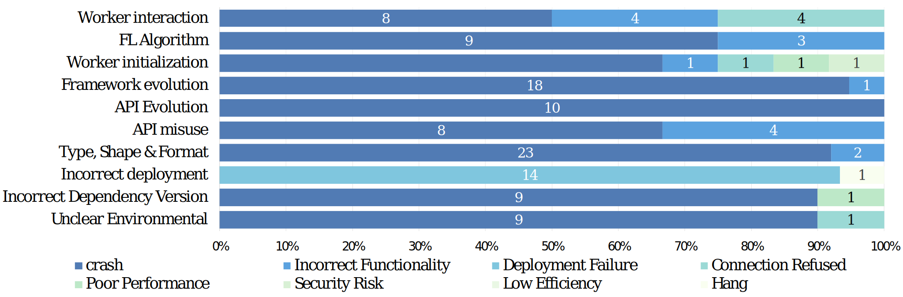

# Understanding the Bug Characteristics and Fix Strategies of Federated Learning Systems

This repository consists of three main folders: Dataset_Init, Manual_Labelling and Quantitative_study.

1. **Dataset_Init** folder: The list of initially mined Issues and Pull Rquests(after **Step 1**) for each framework from GitHub is presented in the file `GitHub_init/{frameworkname}/issues_init.csv` and `GitHub_init/{frameworkname}/PRs_init.csv`.

    Total data and data collection process of 6 federated learning frameworks (Data collection until July 20, 2022):
    <table>
        <tr>
            <th rowspan="2">Framework</th>
            <th colspan="5">
Total
</th>
            <th colspan="2">
Step1
</th>
            <th colspan="2">
Step2
</th>
            <th colspan="2">
Step3
</th>
        </tr>
        <tr>
            <td>
LOC
</td>
            <td>
Forks
</td>
            <td>
Stars
</td>
            <td>
Issues
</td>
            <td>
PRs
</td>
            <td>
Issues
</td>
            <td>
PRs
</td>
            <td>
Issues
</td>
            <td>
PRs
</td>
            <td>
Issues
</td>
            <td>
PRs
</td>
        </tr>
        <tr>
            <td>
                
PySyft

                
FATE

                
TFF

                
Flower

                
Fedlearner

                
PaddleFL

            </td>
            <td>
                
3.8m

                
497.3k

                
206.5k

                
49.1k

                
209.8k

                
87.0k

            </td>
            <td>
                
1,833

                
1,310

                
473

                
293

                
166

                
102

            </td>
            <td>
                
8,218

                
4,371

                
1,901

                
1,136

                
783

                
393

            </td>
            <td>
                
3,062

                
834

                
242

                
118

                
20

                
65

            </td>
            <td>
                
3,491

                
2,800

                
2,630

                
894

                
944

                
153

            </td>
            <td>
                
439

                
271

                
163

                
35

                
6

                
24

            </td>
            <td>
                
649

                
163

                
173

                
36

                
35

                
14

            </td>
            <td>
                
270

                
224

                
68

                
22

                
4

                
11

            </td>
            <td>
                
386

                
129

                
96

                
13

                
29

                
11

            </td>
            <td>
                
80

                
79

                
21

                
8

                
2

                
2

            </td>
            <td>
                
49

                
46

                
26

                
5

                
11

                
6

            </td>
        </tr>
        <tr>
            <td>
Sum
</td>
            <td>
4.8m
</td>
            <td>
4,177
</td>
            <td>
16,802
</td>
            <td>
4,341
</td>
            <td>
10,912
</td>
            <td>
938
</td>
            <td>
1,070
</td>
            <td>
599
</td>
            <td>
664
</td>
            <td>
192
</td>
            <td>
143
</td>
    </table>

    The list of StackOverflow bugs based on tag and keywords is presented in the file [Dataset_init/SO_init/SO_init.csv](Dataset_init/SO_init/SO_init.csv).
2. **Manual_Labelling** folder: In this folder, we have placed all the files associated with our manual labelled result. For the bugs, we further annotate `Symptom`, `Source of Bug`, `Bug Type` and `Root cause`.

    Noted that bugs in `Documentation` and `Others` are excluded from root cause analysis because of their irrelevance to the core FL functions, and bugs from Pull Requests (PRs) are excluded from `Symptom` because in our observations, most PRs are submitted by framework developers or maintainers with limited information.
3. **Quantitative_Study** folder: In this folder, we have placed the source data from Quantitative Study in Section 7.1. In the lifecycle file from Github, we annotate the creation time, closing time and lifecycle.
   In the lifecycle file from StackOverflow, we annotate the creation time, last active time and lifecycle.

    In files of patch size, we annotate the number of added lines, deleted lines, the total number of lines, and changed files.

For the fix strategy, since some instances do not have a clear fix strategy, we summarize some common fix strategies and analyze which root cause can be fixed by them.

**The relationship table between symptom and root cause**:  

    

This relationship figure presents the number of the top 10 root causes for bugs with each symptom. 
Except for *Incorrect Deployment*, *Crash* is the most common symptom for all these root causes. 
We also find that all bugs exhibiting the symptom of *Incorrect Deployment* are produced by *Incorrect Deployment*. 
On the other hand, 83.33\% of bugs exhibiting symptom *Connection Refused* are produced by *Interaction Issues*, which indicates that developers can be suggested to check the implementation of interaction between different parties when a *Connection Refused* bug occurs.

**The relationship table between fix strategy and root cause**:  

    

